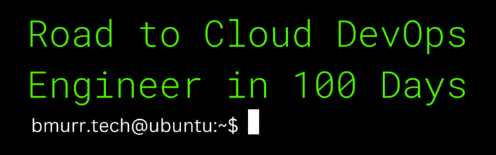
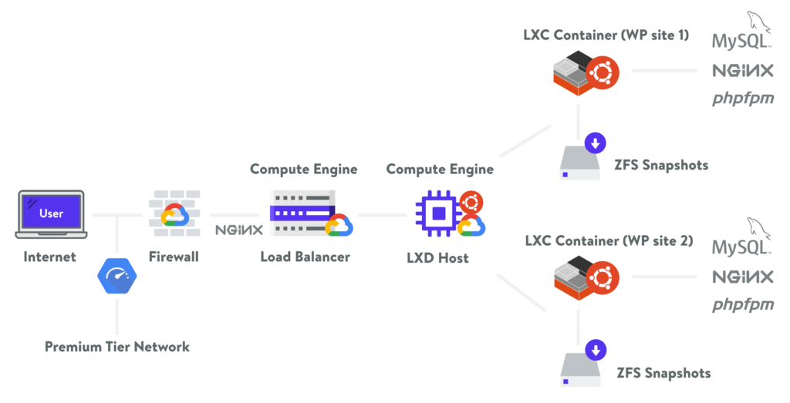
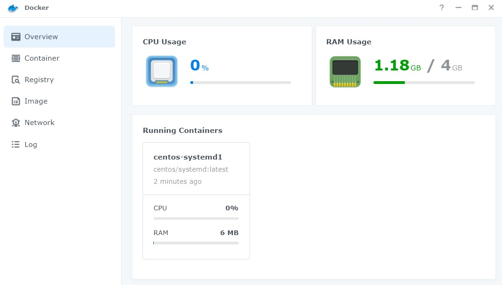
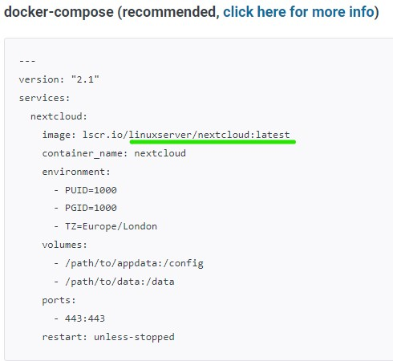
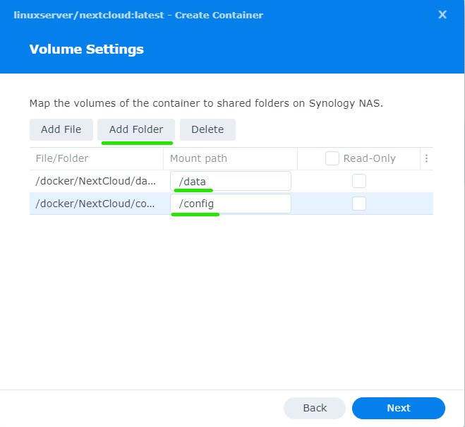

[^canva]
[^canva]: Created in [Canva](https://www.canva.com/))
# Follow my daily journey to certified Cloud DevOps Engineer

>He who aims at perfection will probably miss the mark, but he who aims at nothing, is sure to hit it every time.
>
> --<cite>*Henry Wheeler Shaw, 1876*</cite>
 

**Table of Notable Achievements & Resources:**
1. [Linux Command Lines 1](#linux-command-lines-1)
1.

To-do: 
- [ ] Visual roadmap to Cloud Engineer (design in Canva)
- [ ] Create Chia + MadMax CLI command reference and list (in this repo)
- [ ] Create Online Resume
  - [ ] Step 1 - Markdown Resume (in this repo)
  - [ ] Step 2 - Create Resume using LaTeX[^tyalt1resume]
[^tyalt1resume]: Inspiration credit goes to [Tlyer Alterio](https://github.com/tyalt1/Resume)  

# Day :one:
- Started a course I thought would be everything I needed to become a DevOps Cloud Engineer
- First 5 hours into the course was all about the history of DevOps: agile, social coding, collaboration of developers and operations, etc.
- Listened to a cloud engineer livestream interview of an IT professional’s story of how he transitioned to cloud engineering.
  - He was already employed, so he just networked with the cloud manager
  - He learned what skills a cloud engineer needed
  - He has CCNA certification (networking skills that came in handy later)
  - He started AWS certification training
  - He later realized that he lacked basic Linux, Bash scripting, and Python skills
  - He started Python on codecademy, completed 50% and got hired as a jr. cloud engineer months later (he said codecademy it is worth every penny)

# Day :two:

- Ditched the first DevOps IBM course to deep-dive into research of what it really takes to be a cloud engineer
- Started searching job listings for the top required and most common skills mentioned
- Watched free content on YouTube to learn more about the primary DevOp skills required in real-life applications
- Chose a cloud service (AWS, Azure, Google) to pursue certification
- Paid for Coursera Plus (1yr)
- Searched for “Coursera Plus” and “Shareable Certificate” courses that checked all the boxes for key cloud engineering skills
- Found courses for Linux LFCA Certification, Google Cloud Associate certification prep, and Python
- Created roadmap and timeline (visualizing my goals)

# Day 3 :three:
- Completed required job skill research
- Completed creating learning roadmap by identifying key courses and optimizing for maximum learning to hours invested ratio
- Purchased [bmurr.tech](https://www.bmurr.tech) domain name with SSL and email mailbox
- Created custom domain email box
- Created a GitHub account to track and demonstrate my [0-100 days to Cloud Engineer progress](https://github.com/bmurrtech/0-100-days-cloud-engineer/blob/main/daily_journal.md)
- Made a stunning [About Me Github page](https://github.com/bmurrtech)
- Learned about and started utilizing [basic markdown syntax](https://www.markdownguide.org/cheat-sheet/)

## Learning About Linux History and Distributions
- Enrolled into Linux Fundamentals (Learn Quest) course through Coursera Plus subscription
- Started Week 1 of the course
- Learned the history of Linux.
- :bulb: **Fun fact**: Did you know that the creator of Linux, <mark>Linus Torvalds</mark>, was going to originally name it *Freax*? It is a combination or portmanteau of the two words “free” and “freak," and "x" being an allusion to Linux.
- Learning about Linux Distributions (i.e. Red Hat Enterprise Linux a.k.a. RHEL, 02-22-2000)
- RedHat is a subsidiary of IBM and targets server software for the commercial market
- CentOS is a redistribution with RedHat intellectual property (IP)
- Fedora Linux (11-06-2003) is more innovative (many releases) vs. RHEL philosophy which focuses on stability over innovation
- SUSE (soo-see) a German-based open-source tech company (09-2-1992); owned by Novell from 2003-2011
- Ubuntu is based on Debian (major category of distribution); free to download; ideal for desktop, server, core IoT devices, and robots (note about support: every two years a new update is released and long-term support is offered for 5 years total)
- Debian comes in stable, testing, and untested; similar to Ubuntu but Debian focuses on freedom (community-driven)

## Linux Command Lines 1
- Resource: [Linux CLI Intro Guide](https://linuxjournal.com/content/linux-command-line-interface-introduction-guide)
- 90% of the cloud is Linux based
- ssh is faster than interacting with a GUI
- the "bourne shell" is represented by the $ character to prompt the user for input
- Bourne **Sh**ell (sh) was originally developed by Stephen Bourne (not related to Jason Bourne!) while he was working at Bell Labs. 
- :bulb: **Fun fact**: Bash is an acronym for "**B**orne **A**gain **Sh**ell (B.A.SH). It was written as the free, open-source replacement of Bourne Shell. Because of the open-source nature of Bash, it has been adopted as the default shell on most Linux systems.

| Command | Description |
| ----------- | ----------- |
| pwd | returns the path of the current working directory (dir) |
| cd | change dir |
| cd .. | move one dir up |
| cd to | go straight to home folder |
| cd - | move to your prev dir |
| ls | lists contents of the dir |
| ls -r | will list all the files in the sub-directories as well |
| ls -a | will show the hidden files |
| ls -al | will list the files and dir with detailed info (ex. permissions, size, owner) |
| cat | list the contents of a file on the standard output |
| cat > filename | creates a new file |
| cat > filename1 filename2>filename3 | joins 2 files and stores the output of them in a new file |
| cp | copy files |
| mv | move or rename files |
| mkdir | create a new dir in the current dir |
| rm | remove file and directories |
| rm -r | remove dir and all files inside |
| clear | to clear the screen and start all over |
| history | will show a historical list of commands that were entered in the terminal session |

# Day :four:
- Completed Week 1 of Linux Fund. 100% score on week 1 module quiz :raised_hands: in 1-2 days. See the [Linux week 1 overview](https://d18ky98rnyall9.cloudfront.net/qRQY1L8KRNeUGNS_CnTXuQ_af9f7d4c30204287ac279be086d0c1f1_LinuxSpecializationCourse1Module1.pdf?Expires=1666656000&Signature=UJCINfl9vmCn1I33lc9u3J1zjFtZqeHU5Y33vUs2l35LE2GHXeaxIR~FvMFsgcCcfRKZ2~vk7v8g~wU6eskvWli0NK03Ghx85~Z3hstrd-tjtlCB58xGM0B0EY~nVB2gBYCiWyx5VmOw8JkKo8bPdArWbZOAMpE06p5BTXn4SqU_&Key-Pair-Id=APKAJLTNE6QMUY6HBC5A).
- Learned how to add folders to Git repository
  1. Go to the folder inside which you want to create another folder
  1. Click on New file
  1. On the text field for the file name, first write the folder name you want to create
  1. Then type /. This creates a folder
  1. You can add more folders similarly
  1. Finally, give the new file a name (for example, .gitkeep which is conventionally used to make Git track otherwise empty folders)
  1. Finally, click Commit new file.[^shadowfax]
[^shadowfax]: Credit: Shadowfax on [Stack Overflow](https://stackoverflow.com/questions/12258399/how-do-i-create-a-folder-in-a-github-repository)
- Learned more about Markdown (i.e. adding images, header linking, footers, lists/sublists)
- Watched an amazing video by Network Chuck about configuring Kubernetes (k3s) on a cluster of Raspberry Pi's with Rancher
- Witnessed the power of Nginx as a load balancer
- Learned that Linux largely depends upon the x86 architecture (making arm64, Raspberry Pi's, not ideal for full Kubernetes compatibility)
- Created IT resume and applied for IT specialist jobs focused in DevOps or Linux-based responsibilities
## Zima Board
The Raspberry-Pi-Killer :knife:

- Found out about [ZimaBoard](https://www.zimaboard.com/zimaboard/product), for home lab setup.
  1. The "World’s First Hackable Single Board Server" (kickstarter project)
  1. Quad-core 1.1-2.4GHz (Intel Celeron / Apollo Lake)
  1. 2G-8GB Dual Channel LPDDR4
  1. 16GB-32GB eMMC Storage
  1. 2x SATA 6.0 Gb/s
  1. 2x GbE LAN
  1. 1x PCIe 2.0 x4
  1. 1x Mini-DisplayPort 1.2 4k@60Hz
  1. TDP 6W
  1. Compatible OS Linux/Windows/OpenWrt/pfSense/Android/Libreelec
  1. Passive Cooling

# Day :five:
- Watched [Wolfgang Home Server Ansible Setup video](https://youtu.be/f5jNJDaztqk?t=1334) & was inspired to take on personal homelab/network project utilizing existing my server hardware from home
- Added [cybersecurity.md](https://github.com/bmurrtech/0-100-days-cloud-engineer/blob/main/home_network_cybersecurity.md) for personal home NAS security project
- Added [Ansible Data Dump .md](https://github.com/bmurrtech/0-100-days-cloud-engineer/blob/main/ansible-nas-doc.md) for future reference, for Ansible learning, & for Ansible automation home server project
- Discovered [The LaTeX Project](https://www.latex-project.org/) typesetting system & document builder
- Added a new repo for my LaTeX resume project
  - Want to utilize LaTeX to create my resume
  - Want to make repo able to create a [build of LaTeX document](https://github.com/bmurrtech/resume/edit/main/latex-doc-guide.md)
- Made a to-do list for major [home server project](https://github.com/bmurrtech/0-100-days-cloud-engineer/blob/main/home_network_cybersecurity.md) (I want to showcase Linux, containerization, & Ansible automation skills in the future)
- Signed up for [Python Morsels](https://www.pythonmorsels.com/billing/pricing/) - weekly guided Python practice exercises

## Week 2 of Linux
- [Linux Week 2 infograph overview](https://d18ky98rnyall9.cloudfront.net/06EkHSmFTT-hJB0phb0_Sw_1bc88a9afcaa46eb9afb6f9ae566daf1_LinuxSpecializationCourse1Module2.pdf?Expires=1666828800&Signature=aoPuF1waD9uQQUAOz2mXi4u2Ohb0-Sj6Qu-vji6gUpPJRdpHo3CkcdtEyk7vWUwXsQ9J3qtqZjdV1E2yRPdLZma0OSIALI5h0thXB9sSPt2bWBCK6BvBjI1u9OnuxPMzH0qIzgVirooIa4lmCIeQGoJ2jglClA9cVdqD9EvOR0E_&Key-Pair-Id=APKAJLTNE6QMUY6HBC5A)

### L1: Servers v Desktops
  - Severs: focuses on programs that proved shared resources/services
  - Desktop: focuses on programs that run in a Graphical User Interface (GUI)
  - Servers run prog in two primary ways: 1. as a background process (always running and listening to requests) 2. a process spawned by a parent program that listens for requests
- *Daemon* when a Linux services runs continually in the background, it is called a *daemon* and this processes often end in the letter "d" (ex. "mysqld")
- Major service types include:
  - file servers
  - print servers
  - web servers
  - database servers
  - mail servers
  - network resources servers (DHCP, logging, etc.)

- **Review L1**
  - A Linux *desktop* has programs designed around GUI interactive apps
  - A Linux *server* has programs designed around background services that share resources
  - Daemons often end with the letter "d" in their name

### L2 Web Servers
[^kinstawebserver]
[^kinstawebserver]: Photo Credits go to [Kinsta.com](https://kinsta.com/blog/nginx-vs-apache/)
  - Web servers listen on port 80 and 443 for incoming requests and assign the request to a process to return the response from the following providers:
  - *Apache*: free, open-source, cross-platform web server software released under Apache Lic. 2.0, 1995, compiled modules extend core funct. w/server-side languages (i.e. PHP, Python, Pearl, Tcl, etc.)
  - *NGINX*: free, open-source, cross-platform web server software released under FreeBSD license in 2004; owned by F5 Networks; modular, event-driven architecture can provide predictable performance under high loads (build time); *most popular web server* today with 432M servers running as of April 2021
  - *Lighttpd*: free, open-source, cross-platform web server software released under FreeBSD License in 2015; used in the past by several high-traffic websites (ex. YouTube); 33M servers running as of April 2021.

- **Review L2**
  - Web servers run in the background and serve HTTP and HTTPS requests
  - Apache is used by more sahred hosting providers
  - Nginx has taken much of the web server market because of performance
- Additional web server reading [Nginx v Apache](https://kinsta.com/blog/nginx-vs-apache/)
  - Web pages are "essentially HTML documents"
  - Therefore, you need a "serving" machine to "serve up" the visitor's browser the HTML document for viewing
  - :bulb: Fun-fact: Apache got its name either from 1. a Native American heritage or 2. from a pun on "a-patchy-server" :laughing: which ensued a series of software patches
  - Apache was made popular by its *dynamic module system*. A *module* is a feature that allows users to extend web server functionality. A list of modules can be found [here](https://httpd.apache.org/docs/2.4/mod/)
  - Nginx was created by a Russian dev, Igo Sysoev.
  - Nginx has a paid (Nginx Plus) and free version (BSD-type license).
  - Nginx was originally used as a *load-balancer* or *reverse proxy*
  - A *reverse proxy* "sits in front of a web server and receives all the requests before they reach the origin server and can enhance performance, reliability, and security of the web server."[^reverseproxy]
[^reverseproxy]: [Kinsta.com, *How To Set Up a Reverse Proxy..."](https://kinsta.com/blog/reverse-proxy/)
  - Because NGINX does not have a conf system like Apache, it is not commonly used for retail hosting providers.
  - 
### L3 - Database Servers
- Database Servers listen on the network for incoming requests (often SQL) and respond with data
- Relation Database Model is the dominant used in business applications
- SQL (Structured Query Language) [Official Documentation](https://dev.mysql.com/doc/mysql-getting-started/en/)
  - [Learn Basic SQL ft. Network Chuck](https://youtu.be/xiUTqnI6xk8)
  - Standard query language for DBMS
  - You can use SQL queries to retrieve data according to some criteria (i.e. retrieve name, phone, and email for customers in a specific zip code)
  - `SELECT name, phone, email FROM customers where zip_code = '01234'`
- NoSQL Database model is **document focused**
- *CRUD* stands for **C**reate **R**ead **U**pdate **D**elete

- **L3 Review**
  - Both Relational and NoSQL support CRUD operations
  - Relational is transactional focused
  - NoSQL is document focused

# Day :six:
- researched some AWS cloud project ideas
- created new banner in .gif format
- organzied goals and projects by creating new .md files

### L4 Managing Serviecs
- Init Process - an init program or systemd is the parent process for every process
- init will show the location of the init process (i.e. `readlink -f /usr/sbin/init`)
- [*Systemd*](https://en.wikipedia.org/wiki/Systemd) a software suit that provides an array of system components for Linux operating systems.
  - Its main aim is to unify service configuration & behavior across Linux distributions

- **Managing Service Command with Systemd**
  - `sudo systemctl start [application.server]`
  - `sudo systemctl stop [application.server]`
  - `sudo systemctl restart [application.server]`
  - `sudo systemctl reload [application.server]`
  - `sudo systemctl enable [application.server]`
  - `sudo systemctl disable [application.server]`
  - `sudo systemctl status [application.server]`

- **L4 Review**
  - Systemd is the new standard for service configuration
  - The `which init` command will allow you to see where you process init is located
  - The `readlink` command will allow you to see what process controls your service configuration

- **L4 Lab 1**
  - `ps -aux` shows processes currently running & display the process identifier (PID) number
  - `kill -9 [PID]` to kill the process of a certain PID
  - restart mysqld using the `mysqld` command to run process in the **fore**ground
  - restart mysql via `mysqld &` to run process in the **back**ground

- **L4 Lab 2**
  - [x] Install a Linux distro in Docker.
  - [x] Share distro version and name the process used as "PID 1" with peers in Linux course.

**CentOS - Docker Container**

 - Install Docker on Synology NAS (this will create a "docker" folder in your "File Station"
    - Open the "Package Center" app on the Synology NAS
    - Search for "Docker"
    - Click "install" to get Docker
 - Install a Linux distribution image (ISO) from the Docker application in a new Container
    - Go to "Registry" and search for a Linux distro (i.e. CentOS/systemd:latest)
    - Double click on the OS you want to download. 
    - Once the image has been downloaded, click on "Container" from the Docker app (see the left pane).
    - Select the OS you want to install in a new Container.
    - Choose whether or not you want to be able to edit ports or not (if not, select the "Use the same network as Docker Host" bubble)
    - Name the Container
    - Decide if you want to give the Container root permissions to your Synology NAS OS. If not, uncheck the "Execute container with high priviledge."
    - Check "Enable resouce limitation" to set a limit to the PC resources.
    - Hit Next to move to port settings (if you enabled it earlier). You want to ensure that port 80 (HTTP) is enbaled. Input a arbitrary number for the internal port and hit next.
  - Now you must create a volume folder for CentOS. Click create folder and name the folder inside the "docker" folder that was created on the initial Docker install (i.e. `/centos`). Inside this parent folder, add another folder named whatever you like. This child folder will be the folder path for the CentOS volume. 
  - After you have created the subfolder in, you need to give CentOS a path. So type in `/path` inside the folder input box you created.
  - Hit next and check the box that says "run this container after the wizard is finished" &, finally, click "done"
  - If you did everything correctly, you should now see the OS you installed running in in the "Overivew" tab of Docker   

- **NextCloud - Docker Container**
  - Navigate to the [Docker Hub for NextCloud](https://hub.docker.com/r/linuxserver/nextcloud)
  - Copy the `/linuxserver/nextcloud` line (see photo)  
  - Click on "Image" from the selection menu in Docker, and paste the line into the "Hub Page" box. Hit "Add" and wait for the next popup screen.
  - Next choose the appropriate tag for your CPU architecture (select "latest" if you are using any of the + models of the Synology NAS or you have a x86 CPU. Note: the Raspberry Pi is arm64 architecture and will require a different, compt. tag.)
  - Double-click the image to start the image install
  - Name the Container & decide if you want to give the Container root permissions to your Synology NAS OS. If not, uncheck the "Execute container with high priviledge."
  - Check "Enable resouce limitation" to set a limit to the PC resources.
  - Choose whether or not you want to be able to edit ports or not (if not, select the "Use the same network as Docker Host" bubble) 
  - Click on "Advance Settings" and configure add a "GUID" line and a "PUID" line, also enter 1000 for both values. These numbers can be found at the [Docker Hub for NextCloud](https://hub.docker.com/r/linuxserver/nextcloud). Click "Save."
  - Hit Next to move to port settings (if you enabled it earlier). Here you can set up a Reverse Proxy or just enter an arbitrary number for the ports. Hit next again.
  - Now you must create two folder paths for NextCloud to function. One for `/data` and one for `/config`. The folder system can be formated as follows: docker > NextCloud > data and docker > NextCloud > config.
  - Once you have created the parent and child/subfolders, you can now map the NextCloud paths to these two folders. Enter `/data/` in the "data" folder box, and enter `/config` in the "config" folder box (see screenshot for example).   

- **Access the Terminal of the OS in the Docker Container**
  - Select "Containers" in the Docker app
  - Double-click the OS you wish to access
  - Click on the "Terminal" tab to access the Terminal CLI
  - Click "Create" and that will make a new item on the list called "bash."
  - Click on "bash" to access the CentOS Docker Terminal.

# Day :seven:

- Learned more about the `kill` command
  - `kill -l` will list all the types of kill commands and numbers
  - `kill -9` is "SIGKILL" which means immediate, forced killing of a process
  - `kill -15` is "SIGTERM" is the default kill command (which may not always kill the process)
  - CTRL + Z is a hotkey shortcut for "SIGSTOP" or `kill -19`
  - Pressing CTRL + Z a 2nd time in a row will run "SIGCONT" or `kill -18`
  - CTRL + C is "SIGINT" or `kill -2`
  - `pkill -9 [job_name]` does not require a PID, but a job name.
 
 - `ps` commands is how we see running processes to kill, but there are variants:
    - `ps -aux` displays all processes
    - `ps -u` shows processes for the user only
    - `ps -u | grep [term]` (*grep* - global regular expression print; Linux-lingo for finding/filtering stuff)
    - `pgrep [term]` to print the PID (process ID) to kill it with the `kill` command; *note* not all syst will have `pgrep` installed
    - `ps --help simple` will print the `ps` options
   - `top` or `htop` will show you the running processes sorted by CPU usage (hit "q" to exit)

 - Programs can run in the foreground (CTRL + C will stop it)
   - utilize `ping -c [number] [website]`
   - `sleep 20`
   - CTRL + Z (kill sleeper shortcut)
   - `jobs` will list the sleeping foreground processes
 - Programs can also run in the background (CTRL + C will not stop it)
   - if the program is running in the fg, type `bg [job_ID_number]` to put it in the bg
   - if you want to start a program in the bg immediately, type `ping -c [number] [website] **&**`
   - type `fg [job_ID_number]` to put the background process back to foreground and CTRL + C to kill it
  - Programs have 4 states:
    - Running
    - Waitig (waiting for an event or system resource)
    - Stopped ("T" : "traced" or stopped)
    - Zombie (stopped but still has an entry in the process table)

- Discovered a Linux simulation/emulator/virtualization app for iPad and iPhone called [iSH Shell](https://apps.apple.com/us/app/ish-shell/id1436902243)
- Top APKs to install
  - `apk add bash`
  - `apk add openssh` (to remote access any Linux-based servers)
  - `apk add net-tools`
  - `apk add vim`
  - `apk add curl`
  - `apk add git`
  - `apk add wget`
  - `apk add python3` (to install py3) `python3 --version` (to check ver)
  - pip install (regular pip install doesn't work) must run: `python3 -m ensurepip` (*note* pip is very slow in this app, do not restart, it is just slow)
  - `pip3 install vitrualenv`
- Create Vitrual Environment (VE) in iSh Shell to Install Packages:
  - Create a new folder: `makedir [folder_name]`
  - Go to that folder: `cd [folder_name]`
  - Create a VE: `vitrualenv venv`
  - Load the VE: `source venv/bin/activate`
- VE Packages:
  - Healdless Selenium: `pip3 install selenium` (web automation, web scrapping)
  - Django to check your server `pip3 install django`
  - **Note: Cannot not intall Pandas** :(
- ~~How to Install Alpine Linux on iPad~~
- Python IDEs (on iPad)
  - *Pythonista3* - $15
    - clean interface
    - great for beginners learning scripting
    - no pandas, so for not ideal for data science
  - *Pyto* - $15
    - No natural language processing (i.e. cannot run an LP or LTK)
    - Indentation editor issues (throws random errors at times)
    - Can install additional packages
  - *Carnets* - Free
    - Jupiter-like interface 
    - Ideal for data science newbies
    - SeaBorn does not work (no visualizations)
    - Requires multiple reboots
  - *Python Interpreter* - $7
    - Supports "Sublime" text
    - Many pre-installed packages
    - Easy-to-use interface
    - Can't install custom packages (even if you pay for it)
