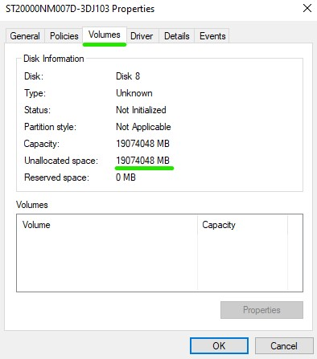
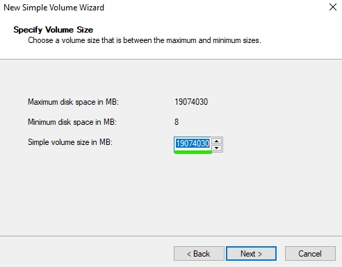
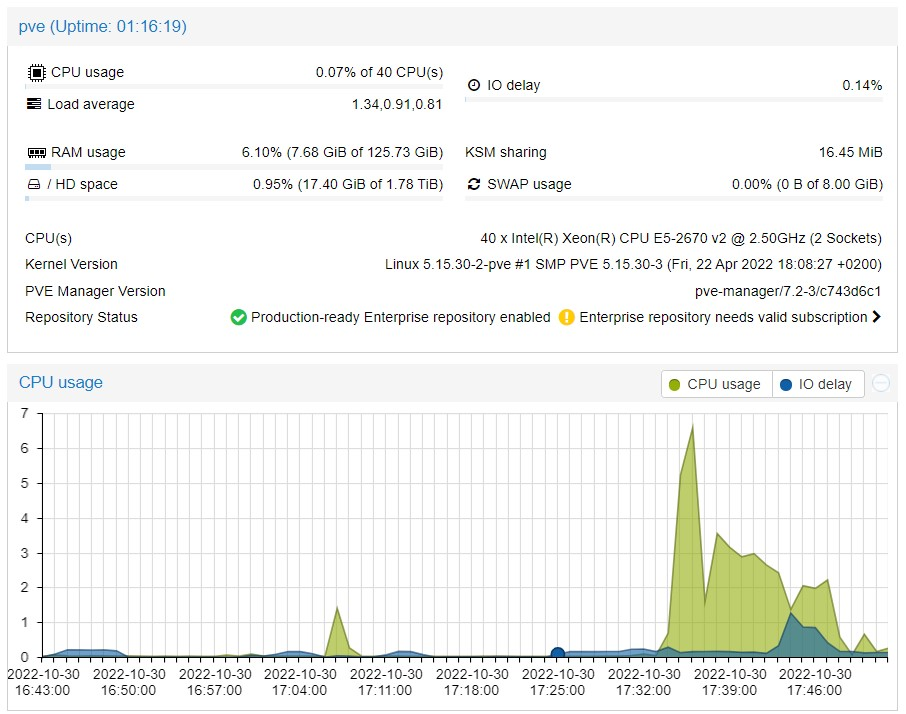
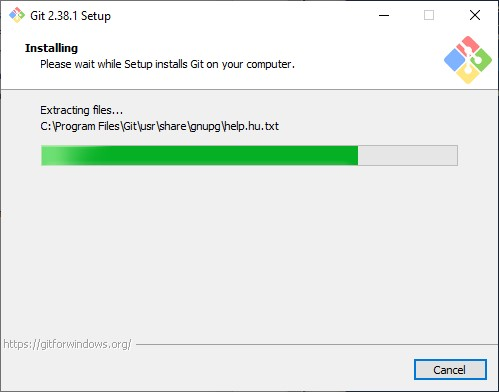
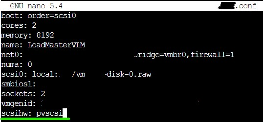
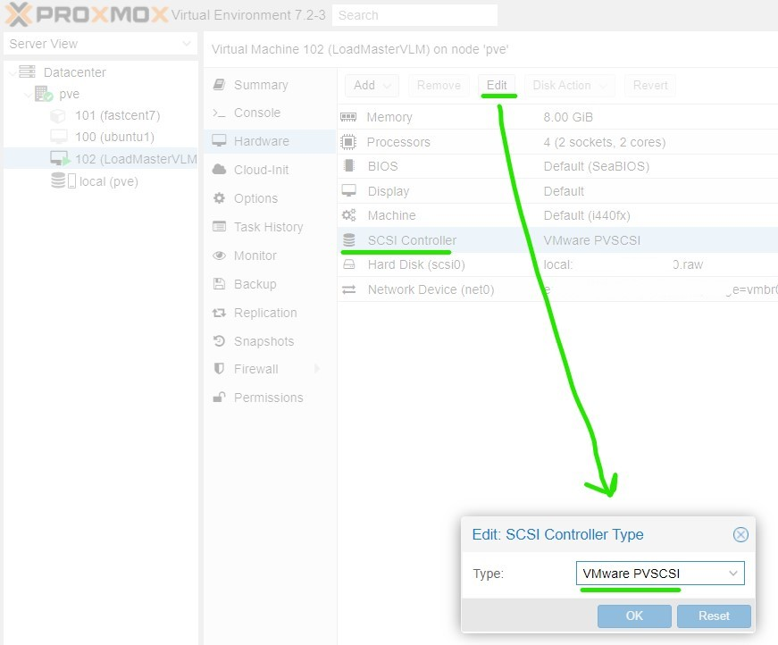
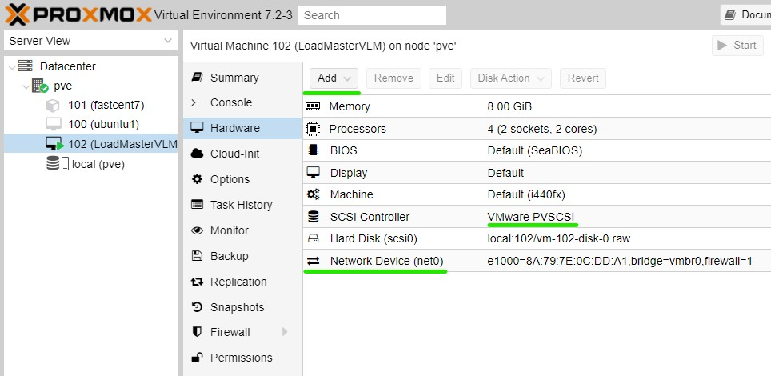

[^canva]
[^canva]: Created in [Canva](https://www.canva.com/))
# Follow my daily journey to certified Cloud Engineer

>He who aims at perfection<br>will probably miss the mark,<br>but he who aims at nothing,<br>is sure to hit it every time.
>
><br>--<cite>*Henry Wheeler Shaw, 1876*</cite>
<br>

**Table of Achievements & Resources:**
1. [Linux Command Lines 1](#linux-command-lines-1)
1. [Cybersecurity Best Practices How-to](#Cybersecurity-Project-1)
1. [How-to Setup ProxMox - a Type 1 Hypervisor](ProxMox-Type-1-Hypervisor-Install)

To-do:<br>
- [ ] Visual roadmap to Cloud Engineer (design in Canva)
- [ ] Create Chia + MadMax CLI command reference and list (in this repo)
- [ ] Create Online Resume
  - [ ] Step 1 - Markdown Resume (in this repo)
  - [ ] Step 2 - Create Resume using LaTeX[^tyalt1resume]
[^tyalt1resume]: Inspiration credit goes to [Tlyer Alterio](https://github.com/tyalt1/Resume)

# Day :one:
- Started a course I thought would be everything I needed to become a DevOps Cloud Engineer
- First 5 hours into the course was all about the history of DevOps: agile, social coding, collaboration of developers and operations, etc.
- Listened to a cloud engineer livestream interview of an IT professional’s story of how he transitioned to cloud engineering.
  - He was already employed, so he just networked with the cloud manager
  - He learned what skills a cloud engineer needed
  - He has CCNA certification (networking skills that came in handy later)
  - He started AWS certification training
  - He later realized that he lacked basic Linux, Bash scripting, and Python skills
  - He started Python on codecademy, completed 50% and got hired as a jr. cloud engineer months later (he said codecademy it is worth every penny)

# Day :two:

- Ditched the first DevOps IBM course to deep-dive into research of what it really takes to be a cloud engineer
- Started searching job listings for the top required and most common skills mentioned
- Watched free content on YouTube to learn more about the primary DevOp skills required in real-life applications
- Chose a cloud service (AWS, Azure, Google) to pursue certification
- Paid for Coursera Plus (1yr)
- Searched for “Coursera Plus” and “Shareable Certificate” courses that checked all the boxes for key cloud engineering skills
- Found courses for Linux LFCA Certification, Google Cloud Associate certification prep, and Python
- Created roadmap and timeline (visualizing my goals)

# Day 3 :three:
- Completed required job skill research
- Completed creating learning roadmap by identifying key courses and optimizing for maximum learning to hours invested ratio
- Purchased [bmurr.tech](https://www.bmurr.tech) domain name with SSL and email mailbox
- Created custom domain email box
- Created a GitHub account to track and demonstrate my [0-100 days to Cloud Engineer progress](https://github.com/bmurrtech/0-100-days-cloud-engineer/blob/main/daily_journal.md)
- Made a stunning [About Me Github page](https://github.com/bmurrtech)
- Learned about and started utilizing [basic markdown syntax](https://www.markdownguide.org/cheat-sheet/)

## Learning About Linux History and Distributions
- Enrolled into Linux Fundamentals (Learn Quest) course through Coursera Plus subscription
- Started Week 1 of the course
- Learned the history of Linux.
- :bulb: **Fun fact**: Did you know that the creator of Linux, <mark>Linus Torvalds</mark>, was going to originally name it *Freax*? It is a combination or portmanteau of the two words “free” and “freak," and "x" being an allusion to Linux.
- Learning about Linux Distributions (i.e. Red Hat Enterprise Linux a.k.a. RHEL, 02-22-2000)
- RedHat is a subsidiary of IBM and targets server software for the commercial market
- CentOS is a redistribution with RedHat intellectual property (IP)
- Fedora Linux (11-06-2003) is more innovative (many releases) vs. RHEL philosophy which focuses on stability over innovation
- SUSE (soo-see) a German-based open-source tech company (09-2-1992); owned by Novell from 2003-2011
- Ubuntu is based on Debian (major category of distribution); free to download; ideal for desktop, server, core IoT devices, and robots (note about support: every two years a new update is released and long-term support is offered for 5 years total)
- Debian comes in stable, testing, and untested; similar to Ubuntu but Debian focuses on freedom (community-driven)

## Linux Command Lines 1
- Resource: [Linux CLI Intro Guide](https://linuxjournal.com/content/linux-command-line-interface-introduction-guide)
- 90% of the cloud is Linux based
- ssh is faster than interacting with a GUI
- the "bourne shell" is represented by the $ character to prompt the user for input
- Bourne **Sh**ell (sh) was originally developed by Stephen Bourne (not related to Jason Bourne!) while he was working at Bell Labs. 
- :bulb: **Fun fact**: Bash is an acronym for "**B**orne **A**gain **Sh**ell (B.A.SH). It was written as the free, open-source replacement of Bourne Shell. Because of the open-source nature of Bash, it has been adopted as the default shell on most Linux systems.

| Command | Description |
| ----------- | ----------- |
| pwd | returns the path of the current working directory (dir) |
| cd | change dir |
| cd .. | move one dir up |
| cd to | go straight to home folder |
| cd - | move to your prev dir |
| ls | lists contents of the dir |
| ls -r | will list all the files in the sub-directories as well |
| ls -a | will show the hidden files |
| ls -al | will list the files and dir with detailed info (ex. permissions, size, owner) |
| cat | list the contents of a file on the standard output |
| cat > [filename] | creates a new file |
| cat > [filename1] filename2>filename3 | joins 2 files and stores the output of them in one new file |
| cp | copies files |
| mv | move or rename files |
| mkdir | create a new dir in the current dir |
| rm | remove file and directories |
| clear | to clear the screen and start all over |
| history | will show a historical list of commands that were entered in the terminal session |
| touch | can create new files & update the time & date |

# Day :four:
- Completed Week 1 of Linux Fund. 100% score on week 1 module quiz :raised_hands: in 1-2 days. See the [Linux week 1 overview](https://d18ky98rnyall9.cloudfront.net/qRQY1L8KRNeUGNS_CnTXuQ_af9f7d4c30204287ac279be086d0c1f1_LinuxSpecializationCourse1Module1.pdf?Expires=1666656000&Signature=UJCINfl9vmCn1I33lc9u3J1zjFtZqeHU5Y33vUs2l35LE2GHXeaxIR~FvMFsgcCcfRKZ2~vk7v8g~wU6eskvWli0NK03Ghx85~Z3hstrd-tjtlCB58xGM0B0EY~nVB2gBYCiWyx5VmOw8JkKo8bPdArWbZOAMpE06p5BTXn4SqU_&Key-Pair-Id=APKAJLTNE6QMUY6HBC5A).
- Learned how to add folders to Git repository
  1. Go to the folder inside which you want to create another folder
  1. Click on New file
  1. On the text field for the file name, first write the folder name you want to create
  1. Then type /. This creates a folder
  1. You can add more folders similarly
  1. Finally, give the new file a name (for example, .gitkeep which is conventionally used to make Git track otherwise empty folders)
  1. Finally, click Commit new file.[^shadowfax]
[^shadowfax]: Credit: Shadowfax on [Stack Overflow](https://stackoverflow.com/questions/12258399/how-do-i-create-a-folder-in-a-github-repository)
- Learned more about Markdown (i.e. adding images, header linking, footers, lists/sublists)
- Watched an amazing video by Network Chuck about configuring Kubernetes (k3s) on a cluster of Raspberry Pi's with Rancher
- Witnessed the power of Nginx as a load balancer
- Learned that Linux largely depends upon the x86 architecture (making arm64, Raspberry Pi's, not ideal for full Kubernetes compatibility)
- Created IT resume and applied for IT specialist jobs focused in DevOps or Linux-based responsibilities
## Zima Board
The Raspberry-Pi-Killer :knife:

- Found out about [ZimaBoard](https://www.zimaboard.com/zimaboard/product), for home lab setup.
  1. The "World’s First Hackable Single Board Server" (kickstarter project)
  1. Quad-core 1.1-2.4GHz (Intel Celeron / Apollo Lake)
  1. 2G-8GB Dual Channel LPDDR4
  1. 16GB-32GB eMMC Storage
  1. 2x SATA 6.0 Gb/s
  1. 2x GbE LAN
  1. 1x PCIe 2.0 x4
  1. 1x Mini-DisplayPort 1.2 4k@60Hz
  1. TDP 6W
  1. Compatible OS Linux/Windows/OpenWrt/pfSense/Android/Libreelec
  1. Passive Cooling

# Day :five:
- Watched [Wolfgang Home Server Ansible Setup video](https://youtu.be/f5jNJDaztqk?t=1334) & was inspired to take on personal homelab/network project utilizing existing my server hardware from home
- Added [cybersecurity.md](https://github.com/bmurrtech/0-100-days-cloud-engineer/blob/main/home_network_cybersecurity.md) for personal home NAS security project
- Added [Ansible Data Dump .md](https://github.com/bmurrtech/0-100-days-cloud-engineer/blob/main/ansible-nas-doc.md) for future reference, for Ansible learning, & for Ansible automation home server project
- Discovered [The LaTeX Project](https://www.latex-project.org/) typesetting system & document builder
- Added a new repo for my LaTeX resume project
  - Want to utilize LaTeX to create my resume
  - Want to make repo able to create a [build of LaTeX document](https://github.com/bmurrtech/resume/edit/main/latex-doc-guide.md)
- Made a to-do list for major [home server project](https://github.com/bmurrtech/0-100-days-cloud-engineer/blob/main/home_network_cybersecurity.md) (I want to showcase Linux, containerization, & Ansible automation skills in the future)
- Signed up for [Python Morsels](https://www.pythonmorsels.com/billing/pricing/) - weekly guided Python practice exercises

## Week 2 of Linux
- [Linux Week 2 infograph overview](https://d18ky98rnyall9.cloudfront.net/06EkHSmFTT-hJB0phb0_Sw_1bc88a9afcaa46eb9afb6f9ae566daf1_LinuxSpecializationCourse1Module2.pdf?Expires=1666828800&Signature=aoPuF1waD9uQQUAOz2mXi4u2Ohb0-Sj6Qu-vji6gUpPJRdpHo3CkcdtEyk7vWUwXsQ9J3qtqZjdV1E2yRPdLZma0OSIALI5h0thXB9sSPt2bWBCK6BvBjI1u9OnuxPMzH0qIzgVirooIa4lmCIeQGoJ2jglClA9cVdqD9EvOR0E_&Key-Pair-Id=APKAJLTNE6QMUY6HBC5A)

### L1: Servers v Desktops
  - Severs: focuses on programs that proved shared resources/services
  - Desktop: focuses on programs that run in a Graphical User Interface (GUI)
  - Servers run prog in two primary ways: 1. as a background process (always running and listening to requests) 2. a process spawned by a parent program that listens for requests
- *Daemon* when a Linux services runs continually in the background, it is called a *daemon* and this processes often end in the letter "d" (ex. "mysqld")
- Major service types include:
  - file servers
  - print servers
  - web servers
  - database servers
  - mail servers
  - network resources servers (DHCP, logging, etc.)

- **Review L1**
  - A Linux *desktop* has programs designed around GUI interactive apps
  - A Linux *server* has programs designed around background services that share resources
  - Daemons often end with the letter "d" in their name

### L2 Web Servers
[^kinstawebserver]
[^kinstawebserver]: Photo Credits go to [Kinsta.com](https://kinsta.com/blog/nginx-vs-apache/)
  - Web servers listen on port 80 and 443 for incoming requests and assign the request to a process to return the response from the following providers:
  - *Apache*: free, open-source, cross-platform web server software released under Apache Lic. 2.0, 1995, compiled modules extend core funct. w/server-side languages (i.e. PHP, Python, Pearl, Tcl, etc.)
  - *NGINX*: free, open-source, cross-platform web server software released under FreeBSD license in 2004; owned by F5 Networks; modular, event-driven architecture can provide predictable performance under high loads (build time); *most popular web server* today with 432M servers running as of April 2021
  - *Lighttpd*: free, open-source, cross-platform web server software released under FreeBSD License in 2015; used in the past by several high-traffic websites (ex. YouTube); 33M servers running as of April 2021.

- **Review L2**
  - Web servers run in the background and serve HTTP and HTTPS requests
  - Apache is used by more shared hosting providers
  - Nginx has taken much of the web server market because of performance
- Additional web server reading [Nginx v Apache](https://kinsta.com/blog/nginx-vs-apache/)
  - Web pages are "essentially HTML documents"
  - Therefore, you need a "serving" machine to "serve up" the visitor's browser the HTML document for viewing
  - :bulb: Fun-fact: Apache got its name either from 1. a Native American heritage or 2. from a pun on "a-patchy-server" :laughing: which ensued a series of software patches
  - Apache was made popular by its *dynamic module system*. A *module* is a feature that allows users to extend web server functionality. A list of modules can be found [here](https://httpd.apache.org/docs/2.4/mod/)
  - Nginx was created by a Russian dev, Igo Sysoev.
  - Nginx has a paid (Nginx Plus) and free version (BSD-type license).
  - Nginx was originally used as a *load-balancer* or *reverse proxy*
  - A *reverse proxy* "sits in front of a web server and receives all the requests before they reach the origin server and can enhance performance, reliability, and security of the web server."[^reverseproxy]
[^reverseproxy]: [Kinsta.com, *How To Set Up a Reverse Proxy..."](https://kinsta.com/blog/reverse-proxy/)
  - Because NGINX does not have a conf system like Apache, it is not commonly used for retail hosting providers.
  - 
### L3 - Database Servers
- Database Servers listen on the network for incoming requests (often SQL) and respond with data
- Relation Database Model is the dominant used in business applications
- SQL (Structured Query Language) [Official Documentation](https://dev.mysql.com/doc/mysql-getting-started/en/)
  - [Learn Basic SQL ft. Network Chuck](https://youtu.be/xiUTqnI6xk8)
  - Standard query language for DBMS
  - You can use SQL queries to retrieve data according to some criteria (i.e. retrieve name, phone, and email for customers in a specific zip code)
  - `SELECT name, phone, email FROM customers where zip_code = '01234'`
- NoSQL Database model is **document focused**
- *CRUD* stands for **C**reate **R**ead **U**pdate **D**elete

- **L3 Review**
  - Both Relational and NoSQL support CRUD operations
  - Relational is transactional focused
  - NoSQL is document focused

# Day :six:
- researched some AWS cloud project ideas
- created new banner in .gif format
- organized goals and projects by creating new .md files

### L4 Managing Services
- Init Process - an init program or systemd is the parent process for every process
- init will show the location of the init process (i.e. `readlink -f /usr/sbin/init`)
- [*Systemd*](https://en.wikipedia.org/wiki/Systemd) a software suit that provides an array of system components for Linux operating systems.
  - Its main aim is to unify service configuration & behavior across Linux distributions

- **Managing Service Command with Systemd**
  - `sudo systemctl start [application.server]`
  - `sudo systemctl stop [application.server]`
  - `sudo systemctl restart [application.server]`
  - `sudo systemctl reload [application.server]`
  - `sudo systemctl enable [application.server]`
  - `sudo systemctl disable [application.server]`
  - `sudo systemctl status [application.server]`

- **L4 Review**
  - Systemd is the new standard for service configuration
  - The `which init` command will allow you to see where you process init is located
  - The `readlink` command will allow you to see what process controls your service configuration

- **L4 Lab 1**
  - `ps -aux` shows processes currently running & display the process identifier (PID) number
  - `kill -9 [PID]` to kill the process of a certain PID
  - restart mysqld using the `mysqld` command to run process in the **fore**ground
  - restart mysql via `mysqld &` to run process in the **back**ground

- **L4 Lab 2**
  - [x] Install a Linux distro in Docker.
  - [x] Share distro version and name the process used as "PID 1" with peers in Linux course.

**CentOS - Docker Container**

 - Install Docker on Synology NAS (this will create a "docker" folder in your "File Station"
    - Open the "Package Center" app on the Synology NAS
    - Search for "Docker"
    - Click "install" to get Docker
 - Install a Linux distribution image (ISO) from the Docker application in a new Container
    - Go to "Registry" and search for a Linux distro (i.e. CentOS/systemd:latest)
    - Double click on the OS you want to download. 
    - Once the image has been downloaded, click on "Container" from the Docker app (see the left pane).
    - Select the OS you want to install in a new Container.
    - Choose whether or not you want to be able to edit ports or not (if not, select the "Use the same network as Docker Host" bubble)
    - Name the Container
    - Decide if you want to give the Container root permissions to your Synology NAS OS. If not, uncheck the "Execute container with high privilege."
    - Check "Enable resource limitation" to set a limit to the PC resources.
    - Hit Next to move to port settings (if you enabled it earlier). You want to ensure that port 80 (HTTP) is enabled. Input a arbitrary number for the internal port and hit next.
  - Now you must create a volume folder for CentOS. Click create folder and name the folder inside the "docker" folder that was created on the initial Docker install (i.e. `/centos`). Inside this parent folder, add another folder named whatever you like. This child folder will be the folder path for the CentOS volume. 
  - After you have created the subfolder in, you need to give CentOS a path. So type in `/path` inside the folder input box you created.
  - Hit next and check the box that says "run this container after the wizard is finished" &, finally, click "done"
  - If you did everything correctly, you should now see the OS you installed running in in the "Overview" tab of Docker <br> 


- **NextCloud - Docker Container**
  - Navigate to the [Docker Hub for NextCloud](https://hub.docker.com/r/linuxserver/nextcloud)
  - Copy the `/linuxserver/nextcloud` line (see photo) <br>
  - Click on "Image" from the selection menu in Docker, and paste the line into the "Hub Page" box. Hit "Add" and wait for the next popup screen.
  - Next choose the appropriate tag for your CPU architecture (select "latest" if you are using any of the + models of the Synology NAS or you have a x86 CPU. Note: the Raspberry Pi is arm64 architecture and will require a different, compt. tag.)
  - Double-click the image to start the image install
  - Name the Container & decide if you want to give the Container root permissions to your Synology NAS OS. If not, uncheck the "Execute container with high privilege."
  - Check "Enable resource limitation" to set a limit to the PC resources.
  - Choose whether or not you want to be able to edit ports or not (if not, select the "Use the same network as Docker Host" bubble) 
  - Click on "Advance Settings" and configure add a "GUID" line and a "PUID" line, also enter 1000 for both values. These numbers can be found at the [Docker Hub for NextCloud](https://hub.docker.com/r/linuxserver/nextcloud). Click "Save."
  - Hit Next to move to port settings (if you enabled it earlier). Here you can set up a Reverse Proxy or just enter an arbitrary number for the ports. Hit next again.
  - Now you must create two folder paths for NextCloud to function. One for `/data` and one for `/config`. The folder system can be formatted as follows: docker > NextCloud > data and docker > NextCloud > config.
  - Once you have created the parent and child/subfolders, you can now map the NextCloud paths to these two folders. Enter `/data/` in the "data" folder box, and enter `/config` in the "config" folder box (see screenshot for example). <br> 

- **Access the Terminal of the OS in the Docker Container**
  - Select "Containers" in the Docker app
  - Double-click the OS you wish to access
  - Click on the "Terminal" tab to access the Terminal CLI
  - Click "Create" and that will make a new item on the list called "bash."
  - Click on "bash" to access the CentOS Docker Terminal.

# Day :seven:

- Learned more about the `kill` command
  - `kill -l` will list all the types of kill commands and numbers
  - `kill -9` is "SIGKILL" which means immediate, forced killing of a process
  - `kill -15` is "SIGTERM" is the default kill command (which may not always kill the process)
  - CTRL + Z is a hotkey shortcut for "SIGSTOP" or `kill -19`
  - Pressing CTRL + Z a 2nd time in a row will run "SIGCONT" or `kill -18`
  - CTRL + C is "SIGINT" or `kill -2`
  - `pkill -9 [job_name]` does not require a PID, but a job name.
 
 - `ps` commands is how we see running processes to kill, but there are variants:
    - `ps -aux` displays all processes
    - `ps -u` shows processes for the user only
    - `ps -u | grep [term]` (*grep* - global regular expression print; Linux-lingo for finding/filtering stuff)
    - `pgrep [term]` to print the PID (process ID) to kill it with the `kill` command; *note* not all syst will have `pgrep` installed
    - `ps --help simple` will print the `ps` options
   - `top` or `htop` will show you the running processes sorted by CPU usage (hit "q" to exit)

 - Programs can run in the foreground (CTRL + C will stop it)
   - utilize `ping -c [number] [website]`
   - `sleep 20`
   - CTRL + Z (kill sleeper shortcut)
   - `jobs` will list the sleeping foreground processes
 - Programs can also run in the background (CTRL + C will not stop it)
   - if the program is running in the fg, type `bg [job_ID_number]` to put it in the bg
   - if you want to start a program in the bg immediately, type `ping -c [number] [website] **&**`
   - type `fg [job_ID_number]` to put the background process back to foreground and CTRL + C to kill it
  - Programs have 4 states:
    - Running
    - Waitig (waiting for an event or system resource)
    - Stopped ("T" : "traced" or stopped)
    - Zombie (stopped but still has an entry in the process table)

- Discovered a Linux simulation/emulator/virtualization app for iPad and iPhone called [iSH Shell](https://apps.apple.com/us/app/ish-shell/id1436902243)
- Top APKs to install
  - `apk add bash`
  - `apk add openssh` (to remote access any Linux-based servers)
  - `apk add net-tools`
  - `apk add vim`
  - `apk add curl`
  - `apk add git`
  - `apk add wget`
  - `apk add python3` (to install py3) `python3 --version` (to check ver)
  - to install `pip` (regular pip install doesn't work by default), you must run: `python3 -m ensurepip` (*note* pip is very slow in this app, do not restart, it is just slow)
  - `pip3 install virtualenv`
- Create Vitrual Environment (VE) in iSh Shell to Install Packages:
  - Create a new folder: `mkdir [folder_name]`
  - Go to that folder: `cd [folder_name]`
  - Create a VE: `vitrualenv venv`
  - Load the VE: `source venv/bin/activate`
- VE Packages:
  - Headless Selenium: `pip3 install selenium` (web automation, web scrapping)
  - Django to check your server `pip3 install django`
  - Note: Cannot not install Pandas :(


- How to [Install Alpine Linux on iPad](https://github.com/ish-app/ish)
  - To set up your environment, cd to the project and run `meson build` to create a build directory in `build`. Then cd to the build directory and run `ninja`.
  - To set up a self-contained Alpine linux filesystem, download the Alpine minirootfs tarball for i386 from the [Alpine website](https://alpinelinux.org/downloads/) and run `./tools/fakefsify`, with the minirootfs tarball as the first argument and the name of the output directory as the second argument.
  - Then you can run things inside the Alpine filesystem with `./ish -f alpine /bin/login -f root`, assuming the output directory is called `alpine`.
  - If `tools/fakefsify` doesn't exist for you in your build directory, that might be because it couldn't find libarchive on your system.
  - You can replace `ish` with `tools/ptraceomatic` to run the program in a real process and single step and compare the registers at each step.
  - Requires 64-bit Linux 4.11 or later.

- Python IDEs (on iPad)
  - *Pythonista3* - $15
    - clean interface
    - great for beginners learning scripting
    - no pandas, so for not ideal for data science
  - *Pyto* - $15
    - No natural language processing (i.e. cannot run an LP or LTK)
    - Indentation editor issues (throws random errors at times)
    - Can install additional packages
  - *Carnets* - Free
    - Jupiter-like interface 
    - Ideal for data science newbies
    - SeaBorn does not work (no visualizations)
    - Requires multiple reboots
  - *Python Interpreter* - $7
    - Supports "Sublime" text
    - Many pre-installed packages
    - Easy-to-use interface
    - Can't install custom packages (even if you pay for it)

- [x] Linux Foundations Week 2 Complete

# Day :eight: 

## Cybersecurity Project 1
- New Sudo Linux User
- Authentication Key Pair - Passwordless Login
- Lockdown All Password Entry Attempts
- Firewall Configuration

### Create a New Linux User w/Sudo Permissions

> About Security Effectiveness of Sudo Users: Adding a new user or multiple users with sudo permissions is equivalent to hackers gaining access to root. For example, a hacker could theoretically edit the bash RC to add an alias (ex. `alias sudo='sudo id; sudo`) which would execute a malicious command every time the user uses `sudo` they won't realize they just executed a malicious command as root. So why add a different user than root? The usefulness of this step is debatable, but many still consider adding users is best practice. I would argue that the best security measure is a strong password, therefore, creating new sudo users *in combination with* creating authentication key pairs for each user (eliminating weak passwords) is one of the best things you can do to secure your server.

- In terminal type: `adduser [username]` & then you will be prompted for a password.
- Enter a temporary password. This password can be simple because we are going to set up the passwordless login next.
- Now to add this new user to the "sudo" permission group: `usermod -aG sudo [username]`
- Type `logout` to logout of the current user
- Now you can try to `ssh` back (log back into) your server using your new sudo user by running `ssh [username]@[IP_address]`

### Create an Authentication Key Pair (BEST DEFENSE!)

- Overview: We will create a public key (think lock) and private key (think key to unlock the lock) on within Windows Powershell/Mac or Linux Terminal.
- First, you need to create a new dir on the remote server. This folder is where you will store the key. Also, you need change/modify (`chmod`) that directory. Here's how:
  - Logged in on the remote server, type `mkdir ~/.ssh && chmod 700 ~/.ssh`
- Now, logout of your remote server by typing `logout` and then open Terminal (Mac) or Powershell (Windows) on your primary computer that you will use to access your server.
- Now that the server has a .ssh dir, you can generate the keys. Type the following in the Terminal/Powershell to generate your public/private keys: `ssh-keygen -b 4096` (`-b [number]` indicates how big you want the key to be)
- By default, the key will be saved in the C:\Users\[username]/.ss./id_rsa directory of your PC. *Important Note* If you have generated ssh keys before, you could accidentally overwrite and lose your original keys, which means **you might lose access to servers you already have**. If so, it will say something like "<filedirectory> already exists. Overwrite (y/n)? Do not type "y" if you do not want to lose your existing keys. Save the keys as a different file instead of overwriting it.
- Next, you will be prompted to input a passphrase for the keys you just generated, but you don't have to use a password if you don't want, in which case, just leave it blank and hit `ENTER`
- If you want to see the keys, type the following in the terminal/powershell: `cd .ssh` to go to that dir, then `ls` to list the contents of that folder. You should now see two files under the "Name" column which should read, "id_rsa" and "id_rsa.pub". The last thing to do is to upload that "id_rsa.pub" key to your server.
- *Note:* This process will be different for Mac and Windows.
  - For **Windows** (inside Powershell): We will use the Security Copy Protocol to copy the public key to the server as follows: (this is a *case-sensitive command*) type, `scp $env:USERPROFILE/.ssh./id_rsa.pub [username]@[IP_address}:~/.ssh/authorized_keys`
    - You will now be prompted for your username password. Go ahead and enter it (this will be the last time you have to enter it!)
  - For **Mac** (inside Terminal): type, `scp ~/.ssh./id_rsa.pub [username]@[IP_address}:~/.ssh/authorized_keys`
  - For **Linux** (inside Terminal): type, `ssh-copy-id [username]@[IP_address]`
    - To test it, try logging into your remote server through your terminal/powershell, `ssh [username]@[IP_address]`
    - If it does not ask for your password, congrats! You have successfully set up an authentication key pair or passwordless Linux server login.

### Lockdown All Password Logins

- Overview: Modify the ssgh_config file. Change the default login port number (22). Change to IPv4-only access (by modifying the AddressFamily). Remove Root login. Remove password logins.
- `sudo nano /etc/ssh/sshd_config` and `ENTER`
- If you are prompted for the sudo password, enter it to continue to view the file contents (this is the root password you originally set when you set up the server in the beginning)
- (Optional) Toggle down to the line that has "#Port 22" and remove the "#" sign. Next, change 22 to some other not-well-known port number, something random which hackers will not be able to guess easily.

> Port Change Note: I labeled changing the default `ssh` port as optional because a port change is useless if someone has the capability to hack into `ssh`, then changing a port is pointless. It wouldn't stop someone like that. Truthfully, a port change may only protect against automated scanners looking for servers with weak passwords. Again, *having a strong password or only using ssh keys* is your best defense because the brute force password attacks attempted by script kiddies shouldn't work.

- Toggle down to "#AddressFamily any" (one under) to change it to read as follows "AddressFamily inet" (this changes it form IPv6 and IPv4 to IPv4-only).
- Toggle down to "PermiteRootLogin yes" to "PermitRootLogin **no**" (because - no! - we do not want to allow god-like root powers open for hackers to exploit)
- Toggle down to: "PasswordAuthentications yes" and change it to: "PasswordAuthentication **no**"

>**Important Note**: this will absolutely require authentication key pairs login to access the server. Do NOT change this if you did not set up passwordless login [see above for how-to](#Create-an-Authentication-Key-Pair)


- Press CTRL + X and then press "y' then press `ENTER` to save the custom configuration
- Next, you must restart the ssh daemon service, type: `sudo  systemctl restart sshd`
 
 > **Do NOT logout** (in case you botched it). Instead, open a new terminal/powershell and login to your server in a separate terminal: `ssh [username]@[IP_address]`


  - After trying to login in a separate window, you should get a "connection refused" message. If you did, this is a *good* sign! Because we closed the default port 22, remember? That's what we want!
  - Keep that second terminal open and try this new command to login: `ssh [username]@[IP_address] -p [your_custom_port_number]`
  
 > The addition of `-p` allows us to specify which port to use to access your server; this number will be what you put in the config

  - If you got in to the server with that second command, congrats! You have successfully locked down all password logins. Take that, hackers!

### Firewall UFW (Uncomplicated Fire Wall)

- Overview: More open ports on your server means more opportunities for hackers to squeeze through your firewall. Fix this by closing unnecessary open ports and configuring UFW.
- To see what ports are currently open on your sever run `sudo ss -tupln`
- What do you see? Is there a big list of open ports? Do you know what each port is used for? Are you unsure? Do a quick google search on the port numbers to check if you need it open or not (i.e DNS servers are needed). If you don't need it, let's uninstall it and close the port.
- Install UFW `sudo apt install ufw`
- By default, UFW will not be active, see this by entering: `sudo ufw status` and you will see "inactive." Now, before you activate UFW, make sure you first make a way in - like a door - for yourself to get into your server.
- First, open that custom login port you made: `sudo ufw allow [your_server_port_number]`
- Now you can enable UFW - let's put up that burn wall, baby! That's sure to burn some hackers! Turn up the heat by typing: `sudo ufw enable` and press "y" to activate it. Run a quick status check to see if it worked: `sudo ufw status`
- Now, like before, let's ensure you set it up right by opening another terminal/powershell and trying to log in now that UFW is active. Login to your sever: `ssh [username]@[IP_address] -p [your_custom_port_number]`
- Did it work? Good. Now, for testing purposes, let's say you want to run a web server with your firewall enabled. If you want traffic to get in, you need to open up port 80 for people to visit your website. Let's try it:
  - Install apache2 to test this out `sudo apt install apache2`
  - Once installed, you need to start it by typing: `sudo systemctl start apache2` and that should now be running.
  - Check you ports again: `sudo ss -tupln`
  - Do you see port 80 listed now? Great, but the firewall is blocking it right now. You can test this by entering your server's IP address in a URL web browser, and nothing will load. Now, let's allow it.
  - Type: `sudo ufw allow 80/tcp` and hit `ENTER` 
- Now it's open! Check it by typing in the URL. It should load an Apache default page. Nice! You bypassed your own firewall, but your IP is still vulnerable to hackers' pings. If you want to make your server IP *ping-proof* and practically invisible to hackers, you gotta change a UFW settings. Here's how (note: this will also make your server invisible to your own `ping` commands, but it is a good security practice to enable, nonetheless):
  - Type `sudo nano /etc/ufw/before.rules`
  - Add just 1 line to the file. Toggle down to where you see the heading which reads, "# ok icmp codes for INPUT" and add the following line at the top: `-A ufw-before-input -p icmp--icmp-type echo-request -j DROP`
  - Next, hit CTRL + X then "y" then ENTER to save the configuration and this will make your IP address invisible to both you and hackers' ping attacks. 
  - Next, you will need to reload UFW for the changes to take affect, type `sudo ufw reload` and then try to `ping -c 10 [your_server_IP]`
  - If you still see the IP, try to reboot your server, type `sudo reboot`
  - Re-login and try to ping your server again. If you get a "request timeout" message, then you have just turned your server invisible - just like Harry Potter's cloak of invisibility, bro! Those hacker squibs ain't gonna get up into your bee's wax now!

## Keep Your Server Updated
- `apt-get dist-upgrade` or `apt-get upgrade` to run a system OS upgrade
- `dpkg-reconfigure unattended-upgrade` to enable automatic updates

> Problem: Enabling automatic updates is a good way to break things. In other words, not all updates are security-related and may break other apps with frequent automatic updates. Normally, this isn't a problem for, say, a homelab where it's okay to have downtime, but if you are a system admin at a company that requires 99.9% uptime, enabling unattended upgrades is sure to cause unwanted, unplanned downtime and service outages. Therefore, the best practice is to schedule maintenance times for important security updates. But if you are just running a homelab for personal use, then automatic updates is a nice feature to enable.

## Handle Files & Directories

### `ls` Commands *Expanded*:
- `ls [options] [paths]`
  -  `ls -a` - lists all files including hidden files. These are files that start with "."
  -  `ls -A` - list all files including hidden files except for "." & ".." - these refer to entries for the current folder (dir) & for the parent dir
  -  `ls -R` - "recurse" lists all files descending down the dir tree from the given path
  -  `ls -r` - reverse the sorting order
  -  `ls -l` - lists files in long formate (i.e. with an index number, owner name, group name, size, & permissions)
  -  `ls -o` - lists files in long formate but w/o the *group* name
  -  `ls -g` - lists files in long formate but w/o the *owner* name
  -  `ls -i` - lists files *with index* number
  -  `ls -s` - lists files *with size*
  -  `ls -S` *sorts* the list *by size* with the *largest at the top*
  -  `ls -t` - sorts by time of modification with the newest at the top

### File & Directory Links

- *Hard Link* : a file (or dir) with one index number (inode) & at least two different files names
  - ex. Filename1 -> inode # [] <- Filename2
  - Linked file is created when command is issued
  - Create a Hard Link by:
    - 'ln [original_filename] [linkname]`
- *Soft Link* : a file with different index numbers (inode).
  - ex. Filename1 inode # [] -> Filename2 inode # []
  - Create a soft link by:
    - `ln -s [original_filename] [linkname]`
- If you delete the original file with a *hard*link, the link still works
- If you delete the original file with a *soft*link the link will be broken
- You can link both files and folders


# Day :nine:

## Windows Disk Utility CLI

| Command | Description |
| ----------- | ----------- |
| diskpart | runs disk partition program in CLI |
| help | lists all the commands for diskpart |
| list disk | lists all the connected disks |
| select disk [#] | lists all the connected disks |
| list volume | lists all the connected disks |
| select volume [#] | lists all the connected disks |
| create partition primary size=[#in_MB] | creates a partition and sets a partition type |
| clean | erases all contents on that disk/volume |
| format fs=[file_system_type] quick | formats a volume to a file system |

## Windows Disk Utility How-to

- Delete a volume:
```sh
list volume
select volume [#]
delete volume
```
> Note: you cannot delete system volumes

- Convert MBR to GPT:

```sh
list disk
select disk [#]
```

> **Important Note**: this next command will *completely wipe the drive, erasing all files*. When working with new drives, it is helpful to first run the `clean` command. Also, Windows will not allow you to add a volume to a drive unless you have first converted the drive `convert <mbr or gpt>`.

```sh
clean
convert [gpt/mbr]
```

- Create a partition: 
```sh 
list disk
select disk [#]
create partition primary size=[#_in_MB]
```

> Note: if you want to create a different types of partition, simply replace `primary` with the desired partition type such as:  `efi`, `extended`, `logical`, or `msr`

> Note on HD Sizing: If you are unsure how many MB to type in as a number when you partition the drive, you can use view it in the drive properties > volumes tab. Just copy and paste the number you see when partitioning a drive. <br>

> **Troubleshooting MB Size Issue**: You may get a message saying: "No usable free extent could be found. It may be that there is insufficient free space to create a partition at the specified size and offset." In my experience, I had to subtract exactly 18MB from the total volume size listed in the drive properties to get it to work.
>> If that doesn't work for you, try this method:
>>
>> * Open Disk Management (Windows button + search "disk" + click on "create and format hard disk partitions"
>> * Right-click the drive you want to partition (it helps to `clean` and `convert` the drive you want to partition in diskpart first).
>> * Click "New Simple Volume" > Hit next on the wizard GUI > take note of the value in "Simple volume size in MB"
>> <br> 
>> * This value is the *max amount* you can partition. Enter this value in the the `diskpart` CLI `create primary partition =size <that_value>`


- Format partition: `list volume`, if the file system (Fs) reads as "RAW" then you must first format the volume to a useable file system first. To do so simply type:
```sh
select volume [#]
format fs=exfat quick
```

> Note: you can format to other fs by changing `exfat` to: `ntfs`, `fat`, `fat32` <br>
> Note: diskpart cannot partition `fat32` volumes greater than 32GB


- Extend a Partition (if you want to expand the size of a partition and have extra space still available on the same drive):
```sh
list volume
select volume [#]
extend size=[#_in_MB]
```

- Shrink a Partition (if you want to shrink the size of a partition):
```sh
list volume
select volume [#]
shrink desired=[#_in_MB]
```

- Assign drive letter:
```sh
select disk [#]
assign letter=[drive_letter]
```

- Mark Partition as Active:
```sh
list volume
select volume [#]
active
```

## Increase Available HD Storage

- Once you are in, you will notice two separate storage units inside of the node created by default (local-lvm and local). It turns out you don't need the local-lvm. So we can delete it to increase your storage capacity. Navigate to `Storage` and then select the "local-lvm" storage unit, and then click `Remove` to delete, and it will be gone.

> Note: We still have some work to do in the shell to fully remove "local-lvm" and increase the storage for "local".

- Click on the node (underneath the `Datacenter` dropdown under the server view_.
- Next, click on `>_ Shell` to enter the command line needed now.

-This will remove the local-lvm:

```sh
lvremove /dev/pve/data
ENTER
y
```

-Now to resize the storage to the maximum size available on the target HD:

```sh
lvresize -l +100%FREE /dev/pve/root
ENTER
```

-And, one last command to finish everything off:

```sh
resize2fs /dev/mapper/pve-root
ENTER
```

-Now if you check the summary, you will see the "local" storage unit of your ProxMox node has been increased fully.

## ProxMox Type 1 Hypervisor Install


- Download the latest "ProxMox ISO [version#] ISO installer" from the [official website](https://www.proxmox.com/en/downloads/category/iso-images-pve)
- Flash the ISO image to a USB drive (at least 8GB in size) using BalenaEtcher or Rufus (free Windows programs)
- Plug the flashed USB drive into the PC you wish to use as your hypervisor
 
> Ensure your PC has an ethernet connection during the ProxMox install

- Press `F12` or other key to enter your boot disk selection or BIOS
- Force the PC to boot from the flash drive you created by selecting the flashdrive from the BIOS menu (google your PC BIOS for how to find the boot drive settings)
- Allow ProxMox to load up and then select "Install ProxMox VE"
- Agree the the terms of service EULA
- Select the harddrive you wish to erase and install the hypervisor on

> Note: This action will erase the drive. If you have files you don't want to lose, first back them up before proceeding.

- Create a password to access your ProxMox hypervisor remotely using a web browser (you will be prompted for this password to access it)
- Customize your install by editing the settings (timezone, hostname, IP CIDR, Gateway, DNS, etc.)

> You should be able to leave the default, pre-filled information for the IP, gateway, and DNS, but you can always customize them to your liking.

- Confirm all the settings and then click "Install" wait for ProxMox to fully install
- After ProxMox has finished installing, it will automatically reboot (reboot manually if it did not). Ensure your ProxMox PC is running and plugged into a working ethernet connection, and then open up a web browser on a different machine and type in the IP CIDR address your created (typically it is https://192.168.1.1:8006 by default, but if you changed it in the set up, you need to use your specific IP to access it).

> Don't forget to include "https://" and add ":8006" at the end of the IP address.

- You will get a warning screen from your web browser telling you the URL address you went to is unsafe, but that's just because you don't have SSL for your ProxMox. It's a false alarm. Just click on whatever options you have to continue to the site.
- Next, you will be prompted to login to ProxMox. Input `root` for the username and enter the password you created at setup to gain access.

> Before deploying and VMs, you can consolidate and expand your storage. Do this *before* creating VMs.

## VM Time, Baby!

> Before we can write an ISO file to our new ProxMox setup, we must edit the directory to allow `Disk Image`.

- Click on `Datacenter` (underneath the "Sever view" pane).
- Click on `Storage` from the list
- Click on the ID (the only ID listed should be "local" if you followed the previous step), and then click `Edit`.
- Click on the `Content` dropdown box and click on `Disk Image` to include it and allow it.

> If you want to create containers inside of ProxMox, then you should also click on `Containers` to include and allow them, too.

- Navigate to ISO Images (under the sever view dropdown menu, you have to click on the ProxMox node).
- Currently, the directory should be empty, so you will need to download your ISOs and then upload them by clicking `Upload`.
- After uploading the VM you want, now it's time to click on the blue button on the top right of the UI that says `Create VM`.
- Give the VM a name and click next.
- Select the ISO image you wish to install (ex. Ubuntu), and click next, and (if you don't want to change any of the default settings) click next again.
- Now, under the `Disks` tab, set the total disk size you wish to allocate to that VM instance, and hit next again.
- Now it is time to set the CPU usage for this VM. Set the number of CPUs you want to set apart for this VM and hit next.
- Now set the memory in MiB.
 
> Note: GB is to MiB *not* a 1:1 ratio like GB is to MB. Use [this conversion calculator for reference](https://mbtogb.com/128-gb-to-mb)

> Note: You can always edit the disk space, core, and memory allocations later.

- Now for network settings. By default, the VM will be bridged to your home network, so it will receive an IP address from your router. If you don't want that, then edit the network settings as desired.
- With everything configured, you are now at the final `Confirm` stage. If everything looks good to you, hit finish to spin up a new VM! Within seconds it will be ready to go. You can check on it from the `Server View`.

> Note: You will still have to go through the initial install and setup phase like you normally would when you first are installing a new OS. When you start the system, go through the necessary install process.

> About Creating Containers: You can also create Docker-like containers with ProxMox by downloading Linux container ISOs and uploading them to ProxMox, and then click on the `Create CT` blue button (right next to the `Create VM` button). The process for creating containers is the same as creating VMs.
  
# Day :keycap_ten:
  
## Kemp LoadMaster - Enterprise Load-balancer Setup on ProxMox
- First-off, why use a load-balancer?
  - **Industry-standard Epic-ness**: If you want to fit in with the cool kids (NASA, Harvard University, Apple, EA, Sony, US Army, JPMorgan, and more!) then you want the Kemp LoadMaster for your homelab.
  - **Custom Domain URL Access**: Access your Plex/Jellyfin server by entering a custom URL (ex. https://<your_custom_domain_name.com>). So, if you want to  access your homelab services (i.e. NAS files, Plex/Jellyfin media server, Prologue audiobooks, VMs, etc.) remotely (when you are not connected to your home network), you will want a load balancer.
  - **Security**: More ports = more network vulnerabilities! Hackers love ports. These digital pirates will growl, "Ahoy! I see me an open port" and then they sail right into your network with their malicious intent. So, if you self-host a website, watch Plex when away from home or at a friend's house, or you just want to access your NAS files outside your house, you must open up multiple ports which, in turn, exposes you to hackers. A load-balancer solves this problem. A load-balancer only requires *one* open port (443), greatly reducing your network vulnerability.
  - **Hide Your Public IP Address**: You *never* should share your public IP address! So, how can you hide it from attackers, and still want to share those amazing homelab apps you built and are so proud of without risking revealing your public IP? Two-words: "load balancer."
- Get a [*multi-compatible* domain name](https://www.a2hosting.com/domains?aid=presearchnode&bid=75dbf1c0) or use one you already have
- Get an enterprise-grade load-balancer called Kemp [get this 100% free version](https://freeloadbalancer.com/)
  - You will first need to create an account with Kemp and then verify your email to get to the download page.
  - You will notice that ProxMox is not listed among other Hypervisors, but that's not a problem. Kemp will still work! Here's how:
  - Select "VMware (OVF)" to download and agree to the terms (there's no difference in functionality, it is just packaged differently)
  - Next, unpack the downloaded zip file that contains the LoadMaster VM image. You can use a free tool like [WinRar](https://www.win-rar.com/start.html?&L=0) or [7-zip](https://www.7-zip.org/). You'll notice some *zip-insception* or *folder-inception* going on because there's another folder within the original folder, so just open both. After unzipping everything and getting to *Limbo-level-inception* you will find Mal--I mean--the files you really looking for.<br> 
  - Like Leonardo DiCaprio, you want to find something down in Limbo. Look for the `.ovf` and the `.vmdk` files. Got 'em? Good, you'll need to know the directory and files names so you can copy them into ProxMox using `ssh` and a SCP client.

  ### Copy Files with SCP
- Linux and macOS systems have a SCP client built in, but you will need to download [Git bash for Windows](https://git-scm.com/download/win). Or just run the following command in Windows Powershell and approve the install when prompted:
  
```sh
winget install --id Git.Git -e --source winget
```
  
<br>
  
- Next, using terminal or Windows Powershell, you want to `scp` the .ovf file to your ProxMox home folder. Type the following:
  
```sh
scp C:\Users\[user]\[directory]\Free-VLM-VMware-OVF-64bit\Free-VLM-VMware-OVF-64bit\[filename].ovf roo@[your_proxmox_ip]:/root/`
```
  
- Next, you need to run and `scp` copy command. We want to copy **2** files (the .ovf and the .vmdk files) from the PC with those files to the ProxMox home directory. First, let's get the `.ovf` file uploaded.
  
```sh
scp C:\Users\[user]\[directory]\Free-VLM-VMware-OVF-64bit\Free-VLM-VMware-OVF-64bit\[filename].ovf roo@[your_proxmox_ip]:/root/`
```

> Tip: Once you have spelled out (or copy & pasted it in the terminal window), you can start the first few letters of the file name and press `TAB` to auto-complete the file you want.

- This `scp` command will securely copy & transfer that file into the `/root/` dir of ProxMox. Now, lets send the other one:
  
```sh
scp C:\Users\[user]\[directory]\Free-VLM-VMware-OVF-64bit\Free-VLM-VMware-OVF-64bit\[filename].vmdk roo@[your_proxmox_ip]:/root/`
```
  
> If you fail to copy/transfer both files, you will get an error message saying the file could not be parsed. So make sure you upload both files.
  
> You can check if the file made it by `ssh` & `ls` into your ProxMox environment. <br> 
  
### Deploying Kemp via `importovf` CLI

- Now we are ready to import Kemp into the ProxMox environment. You will need to use the `importovf` feature to delpoy Kemp.Use the following command:
  
  ```sh
  qm importovf [ID] LoadMaster-VLM-[VERSION].RELEASE-VMware-VBox-OVF-FREE.ovf [SERVER]
  ```
  
  > The `ID` number will be whatever the next ID for your VM is available (i.e. if you only made 1 VM then "101" is the next available ID, just check it in the `Server View` and `Datacenter` dropdown menu). The `SERVER` is name of the local storage listed in the `Data center`. It is probably just `local`.

- Configure your domain nameservers with Cloudflare

> You could always get a free domain from Freenom, but the major drawback is that many free domains available (ending in `.tk`, `.ml`, `.cf`, `.gq`) **will not work** with some remote access applications like Apache Guacamole.
  
### Modifying the Config
- When you first boot the "LoadMasterVLM" you will have problems. It will throw errors and reboot. The problem has to do with the SCSI Controller. By default, ProxMox runs it as LSI, so we need to change it to VMware PVSCSI. We can change that directly from the terminal:
  
```sh
nano etc/pve/qemu-server/[ID].conf
```

- Once you are in the .conf file, use the down arrow to toggle to the bottom line and add the following entry `scsihw: pvscsi` then press `CTRL + X` then `y` then `ENTER` to save this new configuration.
  
<br>
  
- If that worked, you will see the change on the hardware screen.
  
<br>
  
- Also, you wan to give Kemp LoadMaster an internet connection, so go ahead and add it while you are on this screen. Just click `Add` and add your `Network Device`.
- I also recommend adding additional CPU cores and RAM (at least 4GB) to help with running Kemp without a problem as some users mentioned issues when the RAM was below 2 cores and 4GB of RAM (by default, it will give Kemp only 2GB).
  
<br>

 > I want to five credit to Lusk.blog for the helpful insights on setting up Kemp with ProxMox. You can [check out his blog here](https://lusk.blog/how-to/running-free-load-balancer-on-proxmox-or-preventing-a-kemp-loadmaster-boot-loop/). And I thought to leave his helpful last remarks here:
>> "While the free version of Kemp’s LoadMaster does limit the bandwidth to 20mbps, it’s quite sufficient for a lab environment. If you need something without the limitations and can’t afford (or don’t need) the LoadMaster Commercial version, or if you would just prefer to go with an open-source solution, [HAProxy](https://www.haproxy.org/) would be the tool of choice."
  
# Day 11

- Researched blog hosting options
  - Both ~~Ghost~~ Shopify w (with apps) and Hashnode are my choices, but I want to set up Zapier to automate blog auto-post to Medium and Twitter, too
- Updated IT Resume (this is the resume that got me an interview at an IT biz)
- Added IT cover letter to my resume
- Updated resume on Indeed (uploaded to Github, too)
- Applied to many different entry-level IT jobs (and jobs way out of my skill range)
- Adapted my IT cert. roadmap to:
  - ~~CompTIA A+ (via the Google IT Support course)~~
  - By February 2023 [Google IT Automation with Python Professional Certificate](https://www.coursera.org/professional-certificates/google-it-automation)
  - Azure Dev AZ-204
  - AZ-900
  - Linux LFCA
- Started ~~[Google IT Support Professional Certificate on Courera](https://www.coursera.org/professional-certificates/google-it-support)~~ [Google IT Automation with Python Professional Certificate](https://www.coursera.org/professional-certificates/google-it-automation)
  
# Day 12
- Started interview process at local IT job
- Discovered/learned more about Jupyter Labs/Notebook
- Researching way to launch Jupyter Notebook server from homelab to set up Python and RMarkdown environment
- Researching VS server to enable Python and RMarkdown coding on iPadOS
- Set up a Google Docs [Zapier integration](https://zapier.com/apps/google-docs/integrations/zapier)/automation with Hashnode [github zapier integration: publish hashnode story](https://github.com/MihaiBojin/zapier-integration-create-hashnode-story)
  - Automate when file is added to a blog "publish" folder
  - Google Doc to Medium Zapier integration
  - Google Doc to Shopify integration (add google doc manually to Shopify to upload new blog)
  - [Shopify natively supports Markdown text](https://apps.shopify.com/doc2blog?search_id=9e115761-85d8-4ac9-b6a3-0812fc5100d9&surface_detail=markdown+blog&surface_inter_position=1&surface_intra_position=6&surface_type=search)
  - Google docs also supports Markdown if you change the settings. To enable Markdown compatibility with Google Docs:
    - Tools > Preferences > "Automatically Detect Markdown"
- Can add [courses and membership feature to Shopify](https://apps.shopify.com/inflowkit-2?search_id=5506c052-c66a-40f2-a4a4-545b34a640d8&surface_detail=membership&surface_inter_position=1&surface_intra_position=4&surface_type=search)
- Can add [digital content for sale via Shopify](https://apps.shopify.com/digital-downloads-2?search_id=b80c1c88-05da-4a77-890f-7fa6905c39ee&surface_detail=digital&surface_inter_position=1&surface_intra_position=7&surface_type=search)

## Create Custom Copyright-free AI Generated Images
- First up, the easiest (but limited) way to generate AI art is to use free services like [Midjourney](https://midjourney.gitbook.io/docs/) or [Simplified Graphic Design](https://simplified.com/graphic-design). Obviously, all free services will have limitations (i.e. only 10 AI-generated images) that will make users want to buy a subscription. If you just need some one-off AI-art, these services will work, but if you want more powerful features and no limitations--and you happen to have a decent GPU--I recommend using the following resources:
  
- Thanks for the open source tech of [Stable Diffusion](https://stability.ai/blog/stable-diffusion-public-release), it is possible to use your home GPU to generate incredible AI images by simply inputting a description of what photo you want.
  
> **Prompt Crafting**: If you have tried to make your own AI art, you will quickly realize the complexities of getting results you want. In fact, people have created full Master Courses on how to craft AI prompts. Whereas I don't think it is necessary to buy any classes on AI prompt crafting, I do think you should watch free videos on YouTube and use tools to help you generate the AI art you want.
  
* Here's a [**great YouTube video explaining how to craft amazing prompts for AI**](https://youtu.be/lQQzeMeVczo) to get even more amazing AI art.
* Here's a [**GitHub page dedicated to AI Prompt Crafting**](https://github.com/willwulfken/MidJourney-Styles-and-Keywords-Reference). It has an incredible library of terms and art style references you can test out in your AI prompts. If this developer (willwulken) has helped you out, consider buying the guy a cup of gratitude coffee (see his Github page).
  
> **LowRes Art Upscale Trick**: So, depending on your GPU VRAM capacity, you may only be able to generate low res images (4GB can make 256x512 images, 11+GB can make 640x640 art).  In the chipper spirit of letting AI robots take over the world, let's use AI to upscale our lowres art! Thanks to AI intelligence, you can use an AI tool to upscale those AI-generated images by 2X or more! Robots helping robots--it's robot-inception! Anyway, the open-source software is aptly named, [Video2X](https://github.com/k4yt3x/video2x/wiki/GUI) (available for Windows) if you want to check it out.
  
> **Photo-real Images**: If you are trying to upscale photo-real images (not anime-style characters), **remember to change the output setting to "RealSR" or "SRMD"**. By default, Video2x is set to AI-upscale anime-style art. You'll notice there's other AI algorithms with varying degrees of quality to render-speed results (there's really only two art-types at the time of writing this: anime-styled arts and real-life arts). You can read more about the pros and cons of the algos on [k4yt3x's Wiki](https://github.com/k4yt3x/video2x/wiki/Algorithms)
  
- In addition to Stable Diffusion, a developer created a GUI for it so average users can easily create AI images. He has a Patreon for a more polished release of his GUI, but you can [get his free version](https://grisk.itch.io/stable-diffusion-gui) and it will work.
- If you have trouble thinking of a photo description, you can utilize [this free art archive, Lexica Art](https://lexica.art/) to fine tune and generate usable text and a more desirable outcome for the GUI to work with.
- Polyfjord made a great video tutorial on these amazing tools with incredible results. Check out his [tutorial video here]()
  
> Always be cautious about running random `.exe` programs. Double check your download before installing. If it has a `CHECKSUM` that's even better.
  
# Day 13
  
- Used a [free Google Doc to Markdown converter](https://docswrite.com/google-docs-to-markdown) to convert Azure notes to markdown.
- This free service works, but it doesn't last. The images disappear after a day or two it seems.

## Azure Fundamentals Part 1
  
- I am [linking the Azure notes to a google doc here](https://docs.google.com/document/d/1JjoQVgTbCJX2BE3J3x3BqHYt1mkxo2ezkdPsX_gPuwE/edit?usp=sharing).
  
Training Day Resources: [https://on24static.akamaized.net/event/39/50/54/4/rt/1/documents/resourceList1627979893310/mavtdfy22h1fundamentalsresourcelist1627979891280.pdf](https://on24static.akamaized.net/event/39/50/54/4/rt/1/documents/resourceList1627979893310/mavtdfy22h1fundamentalsresourcelist1627979891280.pdf)


  
  ---
  
  ## MadMax (Chia Plotting) CLI
  
  ## How to Check Chia XCH Plot Quality via Chia CLI

`cd $ENV:LOCALAPPDATA\chia-blockchain\[app ver.]\resources\app.asar.unpacked\daemon`

1. Run 50 Check

`.\chia.exe plots check -n 50`

2. Search for proofs with results below "0.77" (ie. "Proofs [33/50], [0.66]")

3. Hit "CTRL + C" to stop process

4. Copy the plot address directory

5. Run a 1000 Check

`.\chia.exe plots check -n 1000 -g [copy & paste chia plot here]`
  
6. Does it approach 1? Look for "Proofs [981/1000], [0.981]" Closer to "1" the better.
  
  ## Create New Network Share Folder in Synology NAS GUI

1. Open Synology NAS GUI
2. Open File Station
3. Create New Share Folder
4. Assign the correct drive
  
  ## Map New Network Drives

1. Right click This PC
2. Select "Map Network Drive"
3. Enter the NAS IP and Bay # (network share name)
4. Select a drive letter from dropdown list

\\[assigned ip address to network attached storage]\[name of share folder]

PC-to-PC Drive Sharing:
1. Right click the drive you want to share between to PCs
2. Click "Give Access to" -> "Advance Sharing"
3. Click on "Advance Sharing" in the properties tab.
4. Check the "Share this folder" box and hit OK, then copy the new network path from the properties tab.
5. Go to the other PC and open file explorer
6. Select This PC then click on "Add a network location" at the top of the window
7. Follow the prompts then enter the "network path" (see the properites tab) to access the drive.

`\\[PC identifier name]\[driver letter]`

## Kubernetes Homelab Install
- Repurpose old PC or get a tiny test computer - [check out the Raspberry Pi Killer!](#zima-board)
- Installed Ubuntu to get started installing necessary packages

> Refer to [Ubuntu's official download and install website for instructions](https://ubuntu.com/tutorials/install-ubuntu-desktop#1-overview)

