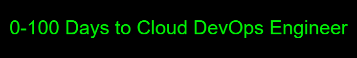

0-100 Days to Cloud Engineer

[^bannermaker]
[^bannermaker]: Created in [Banner Maker](https://banner.godori.dev/)
# Road to Cloud Dev in 100 Days
Follow my daily journey to becoming a certified Cloud Engineer.

>He who aims at perfection will probably miss the mark, but he who aims at nothing, is sure to hit it every time.
>
> --<cite>*Henry Wheeler Shaw, 1876*</cite>
 

To-do: 
- [ ] Visual roadmap to Cloud Engineer (design in Canva)
- [ ] Create Chia + MadMax CLI command reference and list (in this repo)
- [ ] Create Markdown Resume (in this repo)
- [ ] Homelab NAS Projects (run on Ubuntu server):
  - [ ] **Priority** [Cybersecurity for homelab/network](https://github.com/bmurrtech/0-100-days-cloud-engineer/blob/main/home_network_cybersecurity.md)
  - [ ] Docker Containers to run all the following web apps
  - [ ] Homer (interface for NAS)
  - [ ] Nextcloud (dropbox and google cloud alternative; calendar + contact sync)
  - [ ] Jellyfin media server (install on Synology NAS)
  - [ ] Openbooks (ebooks media server)
  - [ ] Deluge (BitTorrent client written in Python)
  - [ ] Jakcett (torrent tracker) + Sonarr & Radarr
  - [ ] PhotoPrism - The iPhone Photo Killer (set up automation in WebDav to auto-upload)
  - [ ] BitWarden | run [VaultWarden - open-source compatible server](https://github.com/dani-garcia/vaultwarden)
  - [ ] Pi-KVM (video-capture of home server: HDMI capture card + Raspberry Pi)
  - [ ] PiHole (VPN into home network, local DNS server, recursive DNS resolver, run Unbound)
  - [ ] pfSense (VLANs, cybersecurity, port-forwarding)
  - [ ] Self-hosting cybersecurity | [click here](place-holder) for step-by-step process and documentation
  - [ ] HomeAssistant (for home automation)

**Table of Key Learning Points & Resources:**
1. [Linux Command Lines 1](#linux-command-lines-1)
1. [Raspberry-Pi-killer Home Lab Mini PC](#zima-board)
1.

## Day :one:
- Started a course I thought would be everything I needed to become a DevOps Cloud Engineer
- First 5 hours into the course was all about the history of DevOps: agile, social coding, collaboration of developers and operations, etc.
- Listened to a cloud engineer livestream interview of an IT professional’s story of how he transitioned to cloud engineering.
  - He was already employed, so he just networked with the cloud manager
  - He learned what skills a cloud engineer needed
  - He has CCNA certification (networking skills that came in handy later)
  - He started AWS certification training
  - He later realized that he lacked basic Linux, Bash scripting, and Python skills
  - He started Python on codecademy, completed 50% and got hired as a jr. cloud engineer months later (he said codecademy it is worth every penny)

## Day :two:

- Ditched the first DevOps IBM course to deep-dive into research of what it really takes to be a cloud engineer
- Started searching job listings for the top required and most common skills mentioned
- Watched free content on YouTube to learn more about the primary DevOp skills required in real-life applications
- Chose a cloud service (AWS, Azure, Google) to pursue certification
- Paid for Coursera Plus (1yr)
- Searched for “Coursera Plus” and “Shareable Certificate” courses that checked all the boxes for key cloud engineering skills
- Found courses for Linux LFCA Certification, Google Cloud Associate certification prep, and Python
- Created roadmap and timeline (visualizing my goals)

## Day 3 :three:
- Completed required job skill research
- Completed creating learning roadmap by identifying key courses and optimizing for maximum learning to hours invested ratio
- Purchased [bmurr.tech](https://www.bmurr.tech) domain name with SSL and email mailbox
- Created custom domain email box
- Created a GitHub account to track and demonstrate my [0-100 days to Cloud Engineer progress](https://github.com/bmurrtech/0-100-days-cloud-engineer/blob/main/daily_journal.md)
- Made a stunning [About Me Github page](https://github.com/bmurrtech)
- Learned about and started utilizing [basic markdown syntax](https://www.markdownguide.org/cheat-sheet/)

### Learning About Linux History and Distributions
- Enrolled into Linux Fundamentals (Learn Quest) course through Coursera Plus subscription
- Started Week 1 of the course
- Learned the history of Linux.
- :bulb: **Fun fact**: Did you know that the creator of Linux, <mark>Linus Torvalds</mark>, was going to originally name it *Freax*? It is a combination or portmanteau of the two words “free” and “freak," and "x" being an allusion to Linux.
- Learning about Linux Distributions (i.e. Red Hat Enterprise Linux a.k.a. RHEL, 02-22-2000)
- RedHat is a subsidiary of IBM and targets server software for the commercial market
- CentOS is a redistribution with RedHat intellectual property (IP)
- Fedora Linux (11-06-2003) is more innovative (many releases) vs. RHEL philosophy which focuses on stability over innovation
- SUSE (soo-see) a German-based open-source tech company (09-2-1992); owned by Novell from 2003-2011
- Ubuntu is based on Debian (major category of distribution); free to download; ideal for desktop, server, core IoT devices, and robots (note about support: every two years a new update is released and long-term support is offered for 5 years total)
- Debian comes in stable, testing, and untested; similar to Ubuntu but Debian focuses on freedom (community-driven)

### Linux Command Lines 1
- Resource: [Linux CLI Intro Guide](https://linuxjournal.com/content/linux-command-line-interface-introduction-guide)
- 90% of the cloud is Linux based
- ssh is faster than interacting with a GUI
- the "bourne shell" is represented by the $ character to prompt the user for input
- Bourne **Sh**ell (sh) was originally developed by Stephen Bourne (not related to Jason Bourne!) while he was working at Bell Labs. 
- :bulb: **Fun fact**: Bash is an acronym for "**B**orne **A**gain **Sh**ell (B.A.SH). It was written as the free, open-source replacement of Bourne Shell. Because of the open-source nature of Bash, it has been adopted as the default shell on most Linux systems.

| Command | Description |
| ----------- | ----------- |
| pwd | returns the path of the current working directory (dir) |
| cd | change dir |
| cd .. | move one dir up |
| cd to | go straight to home folder |
| cd - | move to your prev dir |
| ls | lists contents of the dir |
| ls -r | will list all the files in the sub-directories as well |
| ls -a | will show the hidden files |
| ls -al | will list the files and dir with detailed info (ex. permissions, size, owner) |
| cat | list the contents of a file on the standard output |
| cat > filename | creates a new file |
| cat > filename1 filename2>filename3 | joins 2 files and stores the output of them in a new file |
| cp | copy files |
| mv | move or rename files |
| mkdir | create a new dir in the current dir |
| rm | remove file and directories |
| rm -r | remove dir and all files inside |
| clear | to clear the screen and start all over |
| history | will show a historical list of commands that were entered in the terminal session |

## Day :four:
- [Linux week 4 overview](https://d18ky98rnyall9.cloudfront.net/qRQY1L8KRNeUGNS_CnTXuQ_af9f7d4c30204287ac279be086d0c1f1_LinuxSpecializationCourse1Module1.pdf?Expires=1666656000&Signature=UJCINfl9vmCn1I33lc9u3J1zjFtZqeHU5Y33vUs2l35LE2GHXeaxIR~FvMFsgcCcfRKZ2~vk7v8g~wU6eskvWli0NK03Ghx85~Z3hstrd-tjtlCB58xGM0B0EY~nVB2gBYCiWyx5VmOw8JkKo8bPdArWbZOAMpE06p5BTXn4SqU_&Key-Pair-Id=APKAJLTNE6QMUY6HBC5A)
- Learned how to add folders to Git repository
  1. Go to the folder inside which you want to create another folder
  1. Click on New file
  1. On the text field for the file name, first write the folder name you want to create
  1. Then type /. This creates a folder
  1. You can add more folders similarly
  1. Finally, give the new file a name (for example, .gitkeep which is conventionally used to make Git track otherwise empty folders)
  1. Finally, click Commit new file.[^shadowfax]
[^shadowfax]: Credit: Shadowfax on [Stack Overflow](https://stackoverflow.com/questions/12258399/how-do-i-create-a-folder-in-a-github-repository)
- Learned more about Markdown (i.e. adding images, header linking, footers, lists/sublists)
- Watched an amazing video by Network Chuck about configuring Kubernetes (k3s) on a cluster of Raspberry Pi's with Rancher
- Witnessed the power of Nginx as a load balancer
- Learned that Linux largely depends upon the x86 architecture (making arm64, Raspberry Pi's, not ideal for full Kubernetes compatibility)
- Created IT resume and applied for IT specialist jobs focused in DevOps or Linux-based responsibilities
### Zima Board
The Raspberry-Pi-Killer :knife:

- Found out about [ZimaBoard](https://www.zimaboard.com/zimaboard/product), for home lab setup.
  1. The "World’s First Hackable Single Board Server" (kickstarter project)
  1. Quad-core 1.1-2.4GHz (Intel Celeron / Apollo Lake)
  1. 2G-8GB Dual Channel LPDDR4
  1. 16GB-32GB eMMC Storage
  1. 2x SATA 6.0 Gb/s
  1. 2x GbE LAN
  1. 1x PCIe 2.0 x4
  1. 1x Mini-DisplayPort 1.2 4k@60Hz
  1. TDP 6W
  1. Compatible OS Linux/Windows/OpenWrt/pfSense/Android/Libreelec
  1. Passive Cooling
