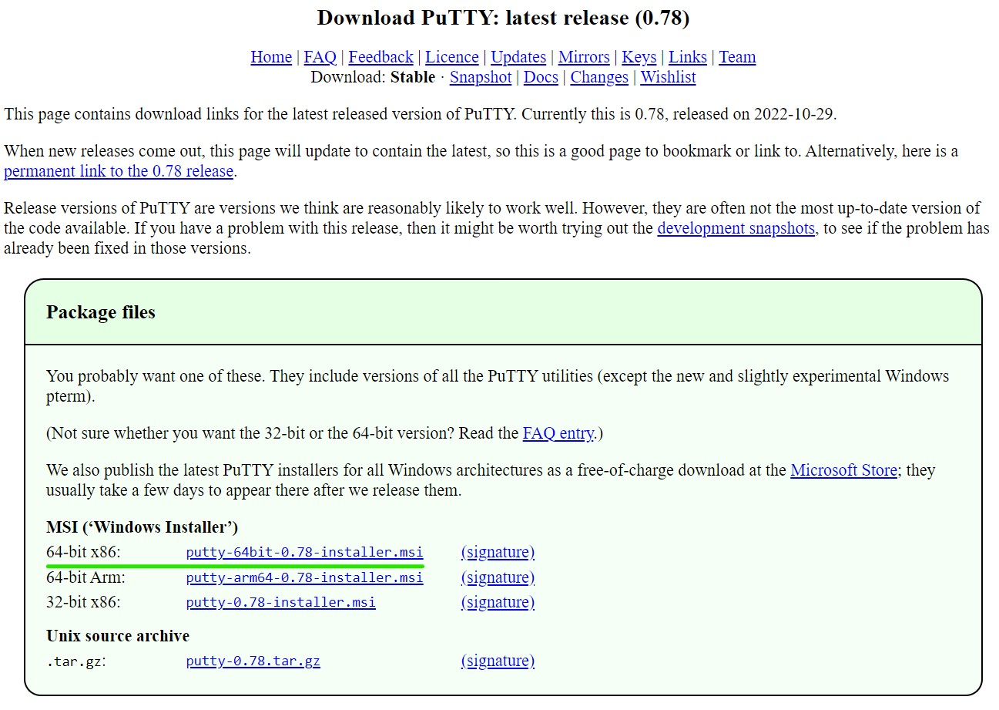

# PuTTY Install & File Upload
- Use something like [PuTTY](https://www.ssh.com/academy/ssh/putty/download#download-putty-installation-package-for-windows) to accomplish an `ssh` file transfer. Let's start a new section on setting up PuTTY (on Windows) to do that.
- Download PuTTY from [Simon Tatham personal home page](https://www.chiark.greenend.org.uk/~sgtatham/putty/latest.html) (unless you are setting this up on  Raspberry Pi, you will want the typical 64-bit x86 download)  

  
- Next, double-click the PuTTY.msi file to start the install and go through the usual install prompts.

  
